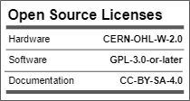

<!--- 
Open Source Assistive Technology: GitHub Readme Template
Version 1.1 (2024-Mar-15)
 --->

<!---
INSTRUCTIONS
This is a markdown template for creating the README.md file in a GitHub repository. This file is rendered and displayed automatically when someone visits the repository.
 --->  
 
 <!--- 
TITLE
Should match the name of the GitHub repository. Choose something descriptive rather than whimsical. 
 --->
# Twitch Switch

<!--- 
SUMMARY
A brief summary of the project. What it does, who it is for, how much it costs.
 --->
The Twitch Switch is for users with limited movement capabilities. Up to three small wireless sensors can capture very small movements. The Twitch Switch can be used for activating up to three switch adapted devices or emulating a mouse or keyboard to operate a digital device such as a computer. 

The Twitch Switch works best for someone who is only able to perform small movements. There are three sensors that can be placed wherever the user has the most controlled, repeatable, intentional movement. Sensor placement can include on the user's finger, wrist, foot, or head. The sensors are powered by rechargeable batteries and connect wirelessly to a controller. The sensitivity of each sensor can be adjusted using knobs on the controller.

The first way to use the Twitch Switch allows the user to activate up to 3 switch adapted devices. Whenever the corresponding switch is moved (even slightly!), the switch adapted device will be activated. 
The second way to use the Twitch Switch is for controlling a digital device such as a computer, tablet, or smartphone. The Twitch Switch can connect via Bluetooth or USB, and has 3 modes: mouse mode, tablet mode, and keyboard mode (which is best for switch control).

The Twitch Switch is intended primarily for people who have some controlled, repeatable, intentional movement, but otherwise have limited mobility and/or dexterity. This device may be beneficial for users with cerebral palsy (CP), spinal cord injuries (SCI), amyotrophic lateral sclerosis (ALS), muscular dystrophy (MD), locked-in syndrome (LIS), traumatic brain injury (TBI), or other disabilities or conditions that significantly limit movement.

The total cost of materials to build this device is around \$360 (plus component shipping). The cost of materials per unit is around \$200 (plus component shipping) if you are able to build in bulk.

## More info at
- [Makers Making Change Assistive Device Library Listing](https://www.makersmakingchange.com/s/product/twitch-switch/01tJR000003UiebYAC)

## How to Obtain the Device
### 1. Do-it-Yourself (DIY) or Do-it-Together (DIT)

This is an open-source assistive technology, so anyone is free to build it. All of the files and instructions required to build the device are contained within this repository. Refer to the Maker Guide below.

### 2. Request a build of this device

You may also submit a build request through the [Makers Making Change Assistive Device Listing](https://www.makersmakingchange.com/s/product/twitch-switch/01tJR000003UiebYAC) to have a volunteer maker build the device. As the requestor, you are responsible for reimbursing the maker for the cost of materials and any shipping.

### 3. Build this device for someone else

If you have the skills and equipment to build this device, and would like to donate your time to create the device for someone who needs it, visit the [MMC Maker Wanted](https://makersmakingchange.com/maker-wanted/) section.

## Build Instructions

### 1. Read through the Maker Guide

The [Maker Guide](/Documentation/Twitch_Switch_Maker_Guide.pdf) contains all the necessary information to build this device, including tool lists, assembly instructions, programming instructions and testing.

### 2. Order the Custom PCBs

This build requires two customs PCBS: one custom PCB for the controller and one custom PCB for each of the three sensors. The sensor PCB has a number of surface mount components and it is recommended to have the PCB fabricator assemble these components on the board.

### 3. Order the Off-The-Shelf Components

The [Bill of Materials](/Documentation/Twitch_Switch_BOM.csv) lists all of the parts and components required to build the device.

### 4. Print the 3D Printable components

All of the files and individual print files can be in the [/Build_Files/3D_Printing_Files](/Build_Files/3D_Printing_Files/) folder. Instructions and settings are provided in the 3D Printing Guide section of the [Maker Guide](/Documentation/Twitch_Switch_Maker_Guide.pdf).

### 5. Assemble the Twitch Switch

Reference the [Maker Guide](/Documentation/Twitch_Switch_Maker_Guide.pdf) for the tools and steps required to build each portion.

## How to improve this Device
As open source assistive technology, you are welcomed and encouraged to improve upon the design. 

## Files
### Documentation
| Document             | Version | Link |
|----------------------|---------|------|
| Maker Guide          | 1.0     | [Twitch Switch_Maker_Guide](/Documentation/Twitch_Switch_Maker_Guide.pdf)     |
| Bill of Materials    | 1.0     | [Twitch Switch_Bill_of_Materials](/Documentation/Twitch_Switch_BOM.csv)     |
| User Guide           | 1.0     | [Twitch Switch_User_Guide](/Documentation/Twitch_Switch_User_Guide.pdf)    |
| Changelog            | 1.0     | [Changelog](CHANGES.txt)     |

### Design Files
<!---
DESIGN FILES
Include a copy of the original design files to facilitate easy editing and customization. Consider also including a generic format (e.g., STEP)
--->
 - [CAD Files](/Design_Files/CAD_Design_Files)
 - [PCB Files](/Design_Files/PCB_Design_Files)

<!---
BUILD FILES
Include a copy of the build files intended for manufacturing. This may include svg files for laser cutting, stl files for 3d printing, Gerber files for custom PCBs, and Arduino files for custom firmware
--->
### Build Files
 - [3D Printing Files](/Build_Files/3D_Printing_Files)
 - [PCB Build Files](/Build_Files/PCB_Build_Files)
 - [Firmware Files](/Build/Firmware_Files)

<!---
ATTRIBUTION
Provide any necessary attribution for designs or components that are included in the device or as part of the project.
--->
## Attribution

The Twitch Switch was designed by the Rehabilitation Engineering Department at Horizon Health's, Stan Cassidy Centre for Rehabilitation (SCCR).  Development was supported through the Government of Canada's Innovation Science and Economic Development [Accessible Technology Program](https://ised-isde.canada.ca/site/accessible-technology-program). The ATP program enabled SCCR to deploy numerous Twitch Switches to users at reduced cost.

The latest design (V3.0) incorporates feedback and suggestions from numerous users, clinicians, and volunteer makers.

The latest design incorporates several commercially available open source hardware components from [Adafruit](https://www.adafruit.com/). The Twitch Switch firmware utilizes the [Arduino](https://www.arduino.cc/) development platform, and a number of libraries developed and shared by the open source community.

<!---
This is the attribution for the template.
--->
The documentation template was created by Makers Making Change / Neil Squire Society and is used under a CC BY-SA 4.0 license. It is available at the following link: [https://github.com/makersmakingchange/OpenAT-Template](https://github.com/makersmakingchange/OpenAT-Template)

<!---
CONTRIBUTORS
List the names of the people that contributed to the design. This could include the original source of the idea, designers, testers, documenters, etc.
--->
### Contributors
- Rachelle Bernier, Horizon Health Network. 
- Marla Calder, Horizon Health Network 
- Natasha Hanson, Horizon Health Network 
- Dorian Hawkes, Horizon Health Network 
- Rick McCaskill, Horizon Health Network 
- Billie O'Connor, Horizon Health Network 
- Kristen Culberson, Horizon Health Network 
- Josie Versloot, Neil Squire Society / Makers Making Change
 
<!---
LICENSE
Add the year(s) for the copyright and the Designer Name. You may use the standard set of open licenses or choose your own for the hardware, software, and accompanying materials.
--->
## License
Copyright (c) 2020-2024 Stan Cassidy Center for Rehabilitation.

This repository describes Open Hardware:
 - Everything needed or used to design, make, test, or prepare the Twitch Switch is licensed under the [CERN 2.0 Weakly Reciprocal license (CERN-OHL-W v2) or later](https://cern.ch/cern-ohl ) .
 - All software is under the [GNU General Public License v3.0 (GPL-3.0)](https://www.gnu.org/licenses/gpl.html).
 - Accompanying material such as instruction manuals, videos, and other copyrightable works that are useful but not necessary to design, make, test, or prepare the Twitch Switch are published under a [Creative Commons Attribution-ShareAlike 4.0 license (CC BY-SA 4.0)](https://creativecommons.org/licenses/by-sa/4.0/) .

You may redistribute and modify this documentation and make products using it under the terms of the [CERN-OHL-W v2](https://cern.ch/cern-ohl).
This documentation is distributed WITHOUT ANY EXPRESS OR IMPLIED WARRANTY, INCLUDING OF MERCHANTABILITY, SATISFACTORY QUALITY AND FITNESS FOR A PARTICULAR PURPOSE.
Please see the CERN-OHL-W v2 for applicable conditions.

Source Location: https://github.com/makersmakingchange/Twitch-Switch

---

## About Makers Making Change

Makers Making Change is a program of [Neil Squire](https://www.neilsquire.ca/), a Canadian non-profit that uses technology, knowledge, and passion to empower people with disabilities.

Makers Making Change leverages the capacity of community based Makers, Disability Professionals and Volunteers to develop and deliver affordable Open Source Assistive Technologies.

 - Website: [www.MakersMakingChange.com](https://www.makersmakingchange.com/)
 - GitHub: [makersmakingchange](https://github.com/makersmakingchange)
 - X (formerly Twitter): [@makermakechange](https://twitter.com/makermakechange)
 - Instagram: [@makersmakingchange](https://www.instagram.com/makersmakingchange)
 - Facebook: [makersmakechange](https://www.facebook.com/makersmakechange)
 - LinkedIn: [Neil Squire Society](https://www.linkedin.com/company/neil-squire-society/)
 - Thingiverse: [makersmakingchange](https://www.thingiverse.com/makersmakingchange/about)
 - Printables: [MakersMakingChange](https://www.printables.com/@MakersMakingChange)

### Contact Us
For technical questions, to get involved, or to share your experience we encourage you to [visit our website](https://www.makersmakingchange.com/) or [contact us](https://www.makersmakingchange.com/s/contact).
